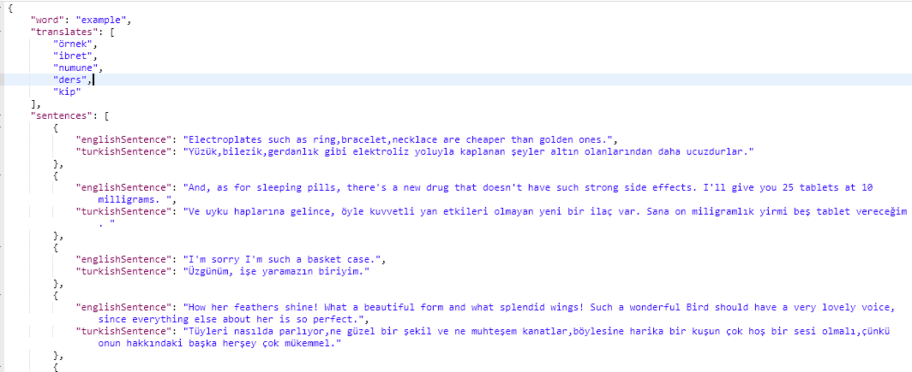

# vocabulary-api
Spring Boot , Jsoup 

English-Turkish Means , Images , Example Sentences About English Words , Voices of English Words
English-Turkish Means , Images , Example Sentences About English Words , Voices of English Words

Translates and Voices are taken from https://tureng.com/

Sample Sentences are taken from https://www.cumlesozluk.com/

İmages are taken from https://www.shutterstock.com

Maybe I will develop this API to be faster API.

You can send request to https://vocabulary-api-springboot.herokuapp.com/word/{ you have to write a word in this section}

<h2>Request</h2>

<h2>Response</h2>

